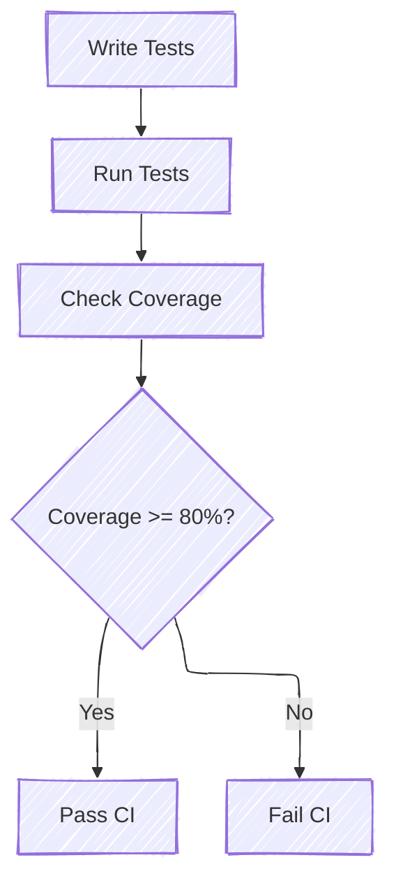

# Writing Tests

One of the benefits of Rust is that testing is "baked-in" and made easy. There is extensive documentation regarding
testing in Rust, so if you are unfamiliar with Rust testing, start with the official documentation and return here
for project-specific details.

Testing in Rust can be broken up into four core categories:

1. **[Unit Testing](https://doc.rust-lang.org/rust-by-example/testing/unit_testing.html):** The developer has access to
   the internal, private state of the module to ensure the internals work as expected.
2. **[Integration Testing](https://doc.rust-lang.org/rust-by-example/testing/integration_testing.html):** Tests are
   written outside of the module and test the code from an external interface standpoint.
3. **[Platform Testing](testing/platform.md):** Tests that run on the platform, physical or virtual.
4. **[Doc Testing](https://doc.rust-lang.org/rust-by-example/testing/doc_testing.html):** Code snippets in inline
   documentation can be compiled and executed. See
     - See also: [Rust Documentation Tests](https://doc.rust-lang.org/rustdoc/write-documentation/documentation-tests.html).

For more, see [Rust Book: Testing](https://doc.rust-lang.org/rust-by-example/testing.html).

## Choosing a Testing Strategy

When writing tests, consider the following questions to help choose a testing strategy:

- **What am I trying to test?**
  - Internal logic -> Unit tests (nearly all logic should have associated unit tests)
  - Public interfaces -> Integration tests
  - Platform-specific behavior -> Platform tests
- **What level of isolation do I need?**
  - Unit tests provide isolation from other modules, while integration tests may involve multiple modules working
    together.
  - Platform tests may require specific hardware or software environments or test scenarios under actual platform
    conditions.
- **What dependencies are involved?**
  - Unit tests focus on the exact unit being tested and may need to make extensive use of mocks and stubs.
  - Integration tests may also need extensive mocks and stubs but use these to test more complex scenarios between
    different modules with the emphasis on those interactions.
- **How Simple Should Debugging Be?**
  - Unit tests are generally easier to debug due to their isolation and execution as a host-based application.
  - Integration tests serve a similar role allowing complex interactions to be tested and debugged in a fast and
    accessible host environment.
  - Platform tests can be the most challenging to debug due to the involvement of hardware or specific platform
    conditions.
    - The [patina_debugger](https://crates.io/crates/patina_debugger) crate can help with source debugging platform
      tests.

Ideally, code should be built utilizing all available strategies. Unit and integration tests are very fast and run
frequently during development, so they assist with verifying basic functionality, are especially useful for finding
regressions during development, and support a rich debug environment with minimal setup to execute the test on a
host system.

Unit and integration tests greatly improve the overall agility of code changes and refactoring. Code design should
consider testability from the start so the code being written can be exercised with maximum effectiveness on the host
system. This might include writing small functions so they are easier to test and accounting for dependency conditions
via test doubles (e.g. mocking) that would exercise cases very difficult or time consuming to reproduce on real
hardware.

Platform tests, while slower and more complex to set up, are essential for validating code behavior in real-world
scenarios. They help ensure that the code works correctly on the target platform, accounting for hardware-specific
behavior and performance impact under actual operating conditions. Platform tests are typically run less frequently,
as they necessitate integrating the Patina library code into a platform binary and executing that binary on a platform.

```admonish note
Patina builds a DXE Core binary for the QEMU virtual platform in the [patina-dxe-core-qemu](https://github.com/OpenDevicePartnership/patina-dxe-core-qemu)
repository. This build can then be used to run platform tests on QEMU in the [patina-qemu](https://github.com/OpenDevicePartnership/patina-qemu)
repository.
```

## Development Dependencies

Rust supports `dev-dependencies` in a crate's `Cargo.toml` file. These dependencies are only used for writing and
running tests, and are only downloaded and compiled for test execution. One common example is `pretty_assertions`,
which extends standard assertions to create a colorful diff.

## Benchmarks

[Benchmarking](https://doc.rust-lang.org/cargo/commands/cargo-bench.html) is another way to write tests. Instead of
caring about code passing for failing certain requirements, you are instead investigating the performance of certain
regions of code. Patina uses the [criterion](https://crates.io/crates/criterion) crate for benchmarking, so one should
follow its documentation when writing benchmarks. Multiple crates (including the
[patina](https://crates.io/crates/patina) and [patina_internal_collections](https://crates.io/crates/patina_internal_collections)
crates) also have some benchmark examples to follow.

Benchmark results are shown on the command line, but graphics are available in the `target/criterion` folder.

**Note**: Benchmarks are not run during testing, nor is performance data tracked over time. Benchmarks are there purely
to help developers track local performance changes when making changes during the development lifecycle.

## Code Coverage

Unit tests and code coverage are an important aspect of our project. It is a simple-to-consume statistic that gives us
some limited confidence in the reliability of newly added code. Even more importantly is that it gives us some peace of
mind that future changes will not cause unexpected regressions or breaking changes, as unit tests that exist to uphold
certain interface expectations would begin to fail.

```admonish note
Needing to change a test's output expectation is a good indication that your change will either impact functionality
or be a breaking change. Any submitted PR should be marked as such.
```

Patina's goal is to keep code coverage over 80%. This gives some leniency for code that cannot be tested (e.g. a error
return after a debug assert), or code that does not need to be tested (e.g. `Debug` implementations, wrappers, etc).
If the code is testable, it should have tests. Importantly, however, unit tests should not be written with the intent
to satisfy the 80% rule. They should be written to meaningfully cover critical logic and edge cases.

```admonish warning
Having a hard target of code coverage (e.g. 80%) can lead to tests being written purely to bump up code coverage. If
this is happening, consider disabling code coverage for that section of code (`#[coverage(off)]`) with valid
justification as to why no code coverage is needed.
```

We use [cargo-llvm-cov](https://github.com/taiki-e/cargo-llvm-cov) as our code coverage reporting tool, as it works
well with Windows and Linux, and can generate different report types. All of our repositories have CI that calculates
and uploads code coverage results to [codecov](https://codecov.io) with an expected patch coverage of at least 80%.

Submitting a PR with less than 80% of changed code covered by tests will result in the check failing. This is a
required check in Patina that will prevent PRs from being merged. If you believe that your code is truly not suitable
to be covered with a unit test, then you can use the `#[coverage(off)]` attribute to disable coverage for that code
section. Provide justification in the PR description as to why the code cannot be tested and add a comment in the code
if it is helpful for other developers to understand why the decision was made.

```admonish note
The `#[coverage(off)]` attribute is unstable and tracked [here](https://github.com/OpenDevicePartnership/patina/issues/804)
in Patina.
```

For local development, we provide a cargo make command (`cargo make coverage`) to generate code coverage data. This
command produces two types of output. The first is a viewable HTML report (`target/coverage/html`) while the second is
a lcov report (`target/lcov.info`) which can be easily consumed by various processing tools like
[Coverage Gutters](https://marketplace.visualstudio.com/items?itemName=ryanluker.vscode-coverage-gutters)


