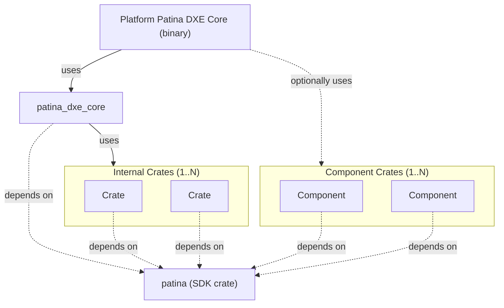

# Introduction

**Welcome to Patina** - a pure Rust project dedicated to evolving and modernizing UEFI firmware with a strong focus on
security, performance, and reliability. This book serves as high-level documentation for developers and platform
owners working with or contributing to Patina.

To put it simply, Patina is a [UEFI spec](https://uefi.org/specifications) compliant pure Rust DXE Core with an
interface for writing monolithically compiled [Patina components](component/getting_started.md) (drivers) using a
dependency injection model. It should be noted that Patina takes a more opinionated stance on some implementation
details to provide a more secure runtime, so we are not fully PI spec compliant. Due to this, there are some key
platform requirements that differ from a non-Patina implementation. See [Patina Requirements](integrate/patina_dxe_core_requirements.md)
for more information regarding this.

**This book is the "catch-all" for Patina:** it contains various documentation regarding Patina that can be broken up
into these 5 categories:

1. Background of Patina and its goals.
2. Integrating the Patina code into your platform.
3. Developing Patina components.
4. Contributing to Patina.
5. Development guidance and standards that apply to both Patina and Patina component developers.

If you have not read this book before, we suggest you start with **(1) [Patina Background](patina.md)**, which outlines
the project's goals and design philosophy.

## Important Crates and Repositories

The Patina project maintains a large list of distinct crates throughout our various repositories
(See [below](#all-repositories)) in order to support proper decoupling and faster build times. If you are just starting
with Patina, there are two main crates that you should review:

**1. [patina_dxe_core](https://crates.io/crates/patina_dxe_core):** The library crate containing the [Patina DXE Core](https://docs.rs/patina_dxe_core/latest/patina_dxe_core/struct.Core.html)
struct definition. This struct is instantiated and configured by a platform in their own respective binary crate,
which ultimately compiles to an EFI binary.

**2. [patina](https://crates.io/crates/patina):** The SDK for working with Patina, whether you are creating a Patina
component or developing the Patina DXE core.

In addition to this, there are two additional repositories you should review, which are specific to integrating Patina
as a platform's DXE Core:

**1. [patina-dxe-core-qemu](https://github.com/OpenDevicePartnership/patina-dxe-core-qemu):** A repository containing
two distinct configurations of the `patina_dxe_core` library crate for our Q35 and SBSA virtual platforms.

**2. [patina-qemu](https://github.com/OpenDevicePartnership/patina-qemu/):** A repository containing two virtual
platforms (Q35, SBSA) that run on QEMU.

## Putting it all together

The [patina-dxe-core](https://crates.io/crates/patina_dxe_core) crate provides the UEFI spec compliant Patina DXE Core.
The Core produces the [EFI System Table](https://uefi.org/specs/UEFI/2.10/04_EFI_System_Table.html) (with the core
provided services) and a PI spec compliant* [DXE Dispatcher](https://uefi.org/specs/PI/1.8/V2_DXE_Dispatcher.html).

Outside of UEFI spec compliance, platforms can attach Patina Components, which are conceptually similar to UEFI
components, but are pure Rust and monolithically compiled with the Patina DXE Core. Some components are written and
maintained by Patina, but are still optional. Over time, the Patina project will add more generically useful
components. We are expecting that additional components will be written by platform maintainers. These may be specific
to their platform or generic for the Patina ecosystem. See [Patina Component Model](component/getting_started.md)
for more information.



## All Repositories

<!-- markdownlint-disable MD013 -->
| Repository | Description |
|------------|-------------|
| [patina](https://github.com/OpenDevicePartnership/patina) | Core codebase for Patina containing Patina-only crates. |
| [patina-readiness-tool](https://github.com/OpenDevicePartnership/patina-readiness-tool) | A DXE core replacement binary that reviews HOBs passed from PEI to DXE to validate your platform is ready to use the Patina DXE Core. |
| [patina-fw-patcher](https://github.com/OpenDevicePartnership/patina-fw-patcher) | A developer tool to quickly patch a new patina-dxe-core binary into a platform's firmware |
| [patina-paging](https://github.com/OpenDevicePartnership/patina-paging) | A paging solution we believe is generic enough to be useful outside of Patina. |
| [patina-mtrr](https://github.com/OpenDevicePartnership/patina-mtrr) | A x86_64 MTRR solution we believe is generic enough to be useful outside of Patina. |
| [patina-edk2](https://github.com/OpenDevicePartnership/patina-edk2) | A collection of definitions and helper utilities designed for EDK II-style C firmware projects that integrate Patina. |
| [patina-dxe-core-qemu](https://github.com/OpenDevicePartnership/patina-dxe-core-qemu) | A reference implementation of patina-dxe-core for our two virtual QEMU platforms. |
| [patina-qemu](https://github.com/OpenDevicePartnership/patina-qemu/) | Two reference virtual platforms (Q35, SBSA) |
| [patina-devops](https://github.com/OpenDevicePartnership/patina-devops) | A repository containing github workflows, actions, and notebooks used across our repositories. |
<!-- markdownlint-enable MD013 -->

## Final Notes

```admonish info
This documentation aims to be as detailed as possible, not assuming any previous knowledge. However some general Rust
knowledge is beneficial throughout the book, and some EDK II knowledge is beneficial to understanding how consume the
final pure-Rust platform Patina DXE core in EDK II style firmware.
```

While you can navigate to any section in this book via the left-side navigation bar, here are the quick links to the
start of the different sections mentioned above:

1. [Patina Background](patina.md)
2. [Platform Integration](integrate/patina_dxe_core_requirements.md)
3. [Component Development](component/getting_started.md)
4. [Contributing to Patina](todo!())
5. [Developer Guides](dev/documenting.md)
